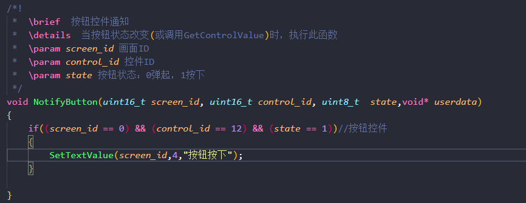
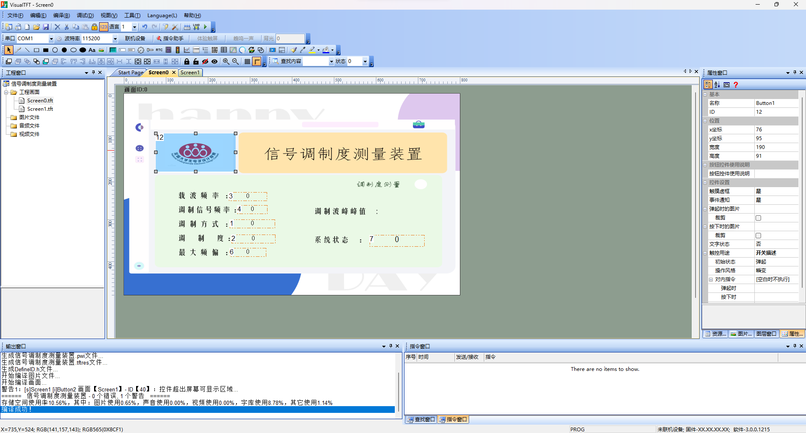
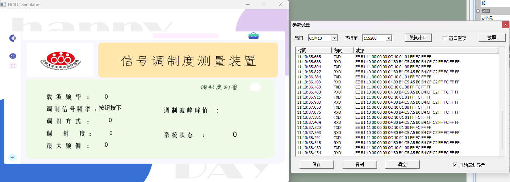

# 串口屏与MSP432之间通讯

​		这个程序主要修改了就是hmi_user_uart.c内串口中断相关的代码，替换成了MSP432的串口中断服务函数，

​		还有把TFT代码8个文件里面的uint8、uchar、uint16、int8、int16、uint32、int32、u8、u16、u32等这些缩写，全部替换成了完整的uint8_t、uint16_t、uint32_t、int8_t、int16_t、int32_t。该说是代码习惯问题吗，我更喜欢完整的，但unsigned char这种完全完整的这个又太长了，不如直接用c库里自带的uint8_t这种，另一个是因为各个编写代码例程的喜欢用各种各样的自定义宏定义，我不喜欢，要就要整个代码统一风格的。

​		闲话说的有点多了，这个代码用作测试的地方为`cmd_process.c`的164行，设置了串口屏的一个按钮控件和文本控件来进行测试

按钮控件的配置

使用虚拟串口屏测试结果

可以看到文本控件，按键id为4的文本控件由`0`变自定义的`按钮按下`，

之后自己调整串口屏按键事件触发服务就在`cmd_process.c`内对应的事件响应函数中自行编码实现